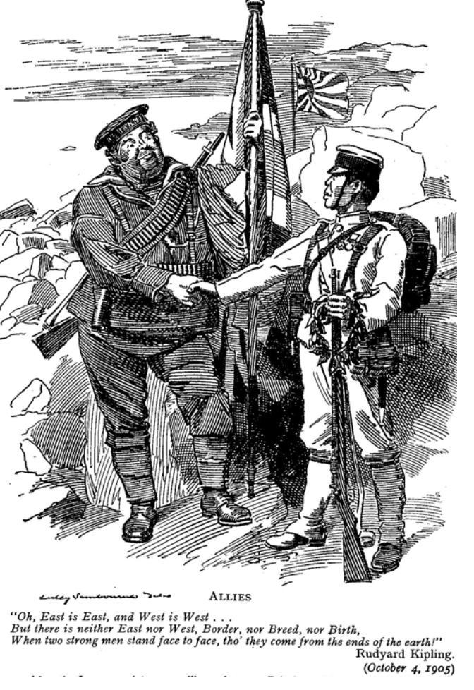

### 1 July 2022
## Imperialism VS colonialism

Imperialism:

- invloves political and economic control (ideas)

Coloniasm

- involves territorial control (physical land)

## British:
- powerful, civilised
- apex/superior of the human race

View of the colonised:
- "half devil"
- "half-child"
- barbaric / uncivilised

## The british imperial mindset in singapore context

In singapore too, most british government officials believed themselves to be superior

Their attitudes were also racist

## impact (I)

- europians were given priviledged treatement
- Asians were barred from membership of European clubs

## impact (II)

- little local involvement in the government
- -> senior ranks of the civil service were reserved for british of pure Europian decent

## Historical concepts

- change and continuity
- Empathy
- Chronology
- Evidence
- Accounts
- Cause and effect (causation)
- Significance
- Diversity

## Question 3

Answer: Mr tan was embarrassed because he felt underserving of the way Thomas addressed him, which implied that the latter was a subordinate to and of a lower rank than himself. However, given Thomas' race and how the British were deemed superior in singapore, Mr Tan did not feeel that it was proper or acceptable for him, a Chinese, to accept the title of "sir" from a British.

## Activity 2 Question 2

This source shows me that the treatment of Asians by the British during that time was unfair/ discriminatory.

### 5 July 2022

## Historical background of Japan

### The Tokugawa Shogunate

Japenese society:
1. Emperor
- This ruler was at the top of Japenese society but had little real power 
2. Shogun and daimyo
- He was the most important daimyo, or large landholdrer, and the actual ruler of Japan
3. Samurai warriors
- They were Japan's Warriors
4. Peasants and artisans
- These workers made up the largest class
5. merchants
- Unlike peasants and artisans, they produced no goods that contributed to the society

## The Meiji Restoration and its impact

Questions:
1. What is Nationalism?
2. Why was the Meiji Restoration started?
3. What were some key features of the Meiji Restoration?
4. What were the effects of the Meiji Restoration?
5. Why is the meiji restoration such and important event in Japenese history?

### The Meiji Restoration: Aimed to strengthen Japan through industrialisation and modernisation.

- The Meiji Leaders believed that modernisation was essential if Japan was to be protected against possible future threats from the outside

### Commodore Matthew Perry's "Gunboat Diplomacy"

- July 1853
- Aimed to secure trading ports in Japan through the signing of a treaty

### This was achieved through:

- political changes which made the emperor the most powerful political figure in Japan
- A military which closely supported the emperor
- Strenghtening the military and economy

### Impacts:

1. Centralisation of power
- 1871: Domains (han) abolished, new prefectures created
- Abolishment of the domains signalled the end of a political and social system in Japan that had lasted for centuries
- Daimyo -> given income and financial compensation to ensure their loyalty to the country
- Samurais -> given only 1/3 of their former stipends
- Emperor reinvented as a focus for popular political loyalty
   - Turned into the high priest of a national cult based on shinto practices
2. Meiji constitution (1889)
- Established the first representative government in Asia
- Set out the rights nad responsibilities of citizens
- Formation of the Diet( Kokkai), the new government of Japan\
Marked a significant shift away from authoritarianism (though not completely)

3. Measures taken
- early 1870s: the government sought to "increase production and encourage industry" by introducing foreign technology
- New land tax law (1873)
- 1870: start of industrialisation
    - Railway Lines laid
		- Telegraph lines strung
		- Etc.

| Year | National Railroads (length of track in miles)|
|------|---------------------------------------------|
|1872  |18  |
|1876  |65  |
|1880  |98  |
|1884  |182 |
|1888  |506 |

|Year|GDP (in millions of yen)|
|----|------------------------|
|1885|3774|
|1890|4639|
|1895|5375|
|1900|5966|
|1905|6214|
|1910|7424|

### Social impacts

4. New Education system
- Aimed at spreading the pratical knowledge and practical arts needed to build national strength
- 1872 ordinance: universal elementary schooling made compulsory
- Literacy rate
    - Eve of the meiji period: 40%
		- End of meiji period: 80%
5. Disintegration of the traditional class hierachy
- End of the samurai class
    - 1876: forced to convert their stipends into government bonds => low income
		- Denied the right to wear a sword (apart from policemen etc.)

### Cultural changes

6. "Civilisation and Enlightenment"
- 文明开化(bunmei kaika)
- Widespread Experimentation with:
    - Western thought and scientific technology
		- Lifestyles, manners and customs of western peoples
There were changes in
- their dressing
- their appearance
- the food they ate
- their conception of time
- their architecture

### Military impact

7. Measures taken:
- January 1873: Conscription ordinance
    - Every young male to serve 3 years on active service, 4 years in reserves
- 1870s: Single centralised organisation structure established for the army and navy
- Army equipped with modern weapons and trained by french and german instructors

Russo-Japanese war (1904 - 1905)

- War fought between Russia and Japan over their respective interests in Korea and Manchuria
- Japenese defeated the Russians

Treaty of Portsmouth (1905)

- Defeated Russians recognised the Japanese as the dominant power in Korea
- Japan Gained control of:
    - Liaodong Peninsula
		- South Manchurian Railway
		- Southern half of the Sakhalin Island

### 12 july 2022

Study the source A:

   The Japanese viewed the Russians as weak and inferior, as they were begging for mercy and peace. This shows that the Russians surrendered to the Japanese.

### 14 july 2022

### AAAAAAAAAAAAAAA

## Causes of WWII In Europe and Asia-Pacific

1. The great depression & how it led to the rise of dictators.
2. Other reasons that led to the outbreak of WWII in Europe
3. Outbreak of WWII in Europe
4. Japan’s response to the Great Depression leading to outbreak of WWII in the Asia-Pacific

Protectionism: America placed tarrifs on imports as an attempt to discourage imports.

## How did the great depression lead to the rise of Dictators?

[Video](https://youtu.be/Ojo8-GhhQcA)

1. How did the Great Depression contribute to the rise of Hitler in Germany?

- Hitler promised remilitarisation
- 6mil ppl with no jobs
- Remilitarisation allowed for more jobs
- Taking resources from other nations

2. How did the different dictators contribute to the outbreak of WWII in Europe?

### Based on your understanding of the video, in your own words, explain how

1. …the Great Depression contributed to the rise of Hitler in Germany.

    - The depression gave hitler a lot of supporters/ attentino and publicity
    - Popularity -> people voted for him
    - Became chancellor 

2. …Hitler’s Germany contributed to the outbreak of WWII in Europe.

    - They became more aggressive 
    - Invaded Austria, Czechoslovakia
    - Invasion of Poland triggered WWII

3. …the Great Depression led to Italy attacking Ethiopia (formerly known as Abyssinia) in 1936.

    - Italy was inspired by Germany's aggression
    - Decided to invade a state weaker than themselves
    - Economy was threatened 

4. …the Great Depression led to Japan attacking Manchuria in 1931

    - Japan's economy bad
    - Thought that attacking their neighbours would help them (bad idea irl dont attack your neighbours)

## Other causes

### (A) Weakness of the League of nations

spoiler alert: they failed

[Video](https://youtu.be/UU6qpj5NRDo)

Watch the following video to find out:
- What is the League of Nations?
    - An international organization, aimed to maintain peace after WWII

- What were the main aims of the League of Nations?
    - Maintain peace, Provide humanitarian aid 

- How did the League operate? 
    - Similar to the UN (United Nations)
- What were some key successes of the League?
    - Abolishing slavery, freeing slaves, improving healthcare, Ending child labour
- What were some key weaknesses/ failures of the League?
	  - Major powers left the League and started remilitarising, Instead of condemning the Italy’s invasion, France secretly tried to reward them in exchange for ending the war, which hugely discredited the league.

### Source Based Skill - Purpose

cartoon from slide 14 ^^^

### (Refer to the cartoon in Slide 14) Why did the cartoonist publish this? Explain your answer using details from the source.)

- Author
    - David Low (Political cartoonist,, critical of the appeasement policy)
- Aim + evidence + explain
    - Criticise that the League of Nations was weak. It was depicted as a doormat, stepped upon by Japan. France gave a rather perfunctory bow to the oorat. Britain was putting make-up for the League of nations, trying to make it look good. This shows that the League of Nations had no power to stop Japan’s aggression. Not only did the members like Britain and France not intervene, their actions were depicted as whimsical and ludicrous, further emphasizing the weakness of the League of Nations
- Action Word
    - Influence
- Audience
    - British citizens
- Anticipated Response
    - Angry that the league of nations had no real power to stop aggression / criticize the LON
- Context
    - Japan invaded manchuria, and the league of nations verbally condemned japan. Japan left the LON.

### 15 july  2022

### Meiji restoration: 

## Study source A:

- What can you infer about the way the Japanese viewed the Russian soldiers? Explain your answer. [4] (Note: You only need to provide 1 inference for this question.)

Inference:
The Japanese viewed the Russian soldiers with contempt/viewed them as weak/inferior.

Evidence: 
This can be seen in the source where the Russian soldiers were depicted as fearful of the Japanese soldiers. One of the Russian soldiers knelt and begged for mercy. The other one appeared to be shrieking in fear. Yet, the Japanese were merely dangling dolls of Japanese soldiers at them.

Explanation:
This tells us that the Japanese regarded the Russians with much derision since the Russian soldiers were so easily frightened - even soldiers of dolls petrified them. 

## Study source B:

- What can you derive about the way Japan was viewed by the West from 1905? Explain your answer. [4] (Note: You only need to provide 1 inference for this question.)

Inference: 
Japan was viewed as equal by the British

Evidence:
This can be seen in the source in how the figures representing Britain and Japan are both in the foreground of the cartoon, shaking hands and standing on level ground. The Japanese soldier is also not portrayed in a demeaning manner. In addition, the poem accompanying the cartoon proclaims how there is “neither East nor West” and refers to both figures as “Strong men”

Explanation:
This tells us that the British gave full recognition of Japan’s equal standing.

## Purpose questions

### Why did the author publish the Source?
### Why was this source published?

### 5As + Evidence Explanation + Context
- Author
- Aim
- audience
- action verb
- anticipated response
    - Change in mindset
    - Change in behavior

### 22 July 2022

## Source A:

### The geography of Malaya* is a factor in its defence. The coastal plains were about 15 miles in width and filled with mangrove swamps. The mountain range, which runs from north to south is covered with dense jungle and vast areas that are almost unknown. Roads are few and heavily guarded, so that an invading army would be at the mercy of defenders securely hidden in the jungle.

*Malaya - a term that broadly encompasses a set of states on the Malay peninsula and present-day Singapore

How do you think such a report would affect the perceptions and attitudes of…

- The british towards Singapore's defence?
    - British would perceive that it would be easy to defend Singapore/adopt a complacent attitude. According to the source, the coastal plains, mountain range and dense jungle would make it difficult for the invaders. Hence, the british would think that singapore would have the upper hand since the geography of Malaya would work to the advantage of the defenders.

- The locals with regard to how vulnerable Singapore was to attack?
    - The locals would feel that Singapore was not that vulnerable since the dense jungle in Malaya would pose difficulties for invaders. Defenders hiding in the jungle would slow down advancing invaders.

### 25 july 2022

## The fall of Singapore

### Battle of Singapore

- 8-15 Febuary 

### The british surrender

- 15 february 1942
- Decision made by British Lieutenant General Arthur E. Percival in order to avert inevitable massacre

### 28 July 2022

## Task 3: Individual response

- Write a short personal response to the discussion question in your notebooks
- Was it British ineptitude or Japanese superiority that sealed Singapore’s fate in 1942?
- you should:
    - state your stand
    - Explain why

### Answer:

I think it was the British ineptitude that sealed Singapore's fate in 1942. The British did not provide enough aircraft to defend the airfields, had fewer and outdated equipment, did not and failed to recognise the use of tanks, had poor communication as well as a lack of physical and psychological preparedness, lack of training, were quick to retreat, clumsy, unaggressive, Slow, had practical unfamilitary, werent able to swim, didnt deploy resources well and had a lack of good leadership. All these ineptitudes lead to the fall of singapore. 

### 29 July 2022

### Quality of troops

| British | Japanese |
|-----|-----|
| Weak | Hardy|
| Not/poorly trained | Well-trained |
| badly equipped | Disciplined |
| Inexperienced | Experienced in amphibious warfare |
| Irresolute | Determined |

### Availability & quality of war machinery/equipment

| British | Japanese|
|------|--|
|No tanks for protection|brought tanks|
|no anti-tank guns| also used bicycles|
|Aircraft: Insufficient and outdated| Up to date weaponry|
|   | Modern airforce comprising "Zero" fighter planes |

### Leadership

| British | Japanese |
|-----|-----|
| Uninspiring (partly due to his manner and appearance) | Inspiring |
| Lacked commanding presence | commanded respect; capable of  boosting soldiers' morale |
| Overly careful | Highly adept at military tactics |
|     | Risk-taker| 

### War tactics

| British | Japanese|
|-----|----|
|Numerous tactical errors [^eg]| Effective tactics incorporating "mobility,aggressiveness and deception" that compensated for their weaknesses|

[^eg]: e.g defending the northeast rather than the northwest coastline 

### Pre-war preparation

| British | Japanese |
|-----|----|
| Inadequate due to: | Well prepared; made audacious planning|
| focus on the European theatre of war| E.g Espionage centre set up in singapore, spies were sent to gather information etc |
| Complacency |     |

AAAAAAAAAAAAAAA im sad

## British military administration 
 
During the Japanese occupation:
- Hunger
- Poverty
- Disease
- Wrecked infrastructure 

### The British was expected to solve them

Successes: 
- They restored basic infrastructure like water, electricity, and gas. 
- They prioritised education and made it available to the people
- They dealt with the war crimes: “Double Tenth Trial”
- They restored law and order with a new police recruiting campaign 

Failures:
- Failed to appease the Chinese community, who though the outcome of the 1947 sook ching trial was too lenient (7 charged and found guilty, 2 sentenced to death, 5 life imprisonment)
- Exploitive employment
- Exhibited racism to the local population
- Failed to deal with corruption

### How far did the BMA improve the people’s lives by the end of its period of rule? (did not improve)
- The BMA failed to improve the lives of people because it did not ensure fair employment. The significant number of 102 000 workers employed by the BMA in the reconstruction work were paid poorly and some were even forced into servitude. This must have affected people deeply because without sufficient income, people will continue in poverty and hunger.

### How far did the BMA improve the people’s lives by the end of its period of rule? (improve)
- The BMA improved the lives of people because it managed to make education available for many people. Within three weeks of the administration, 14 Malay and 14 English schools were reopened. By the end of 1945, 66 chinese, 37 english and 21 malay schools were in operation. By march 1946, 62,000 children were in school. The many students receiving education shows that BMA did improve the lives of people. Furthermore, with more receiving education, the lives of people can gradually improve as they would be able to find better employment and more opportunities.

### 29 September 2022

## How did external developments influence the people’s response to British rule after WWII

### External developments:

- Growing influence of Communism
    - Cold war (USA vs Soviet Russia) god bless the united shades.
        - Tension between United States and Soviet Union
        - Different ideology : democracy/capitalism vs communism
    - Malayan Emergency
        - Caused by the deaths of three European rubber planters. Following their murder, a state of emergency was declared and the MCP (Malyan communist party) was declared illegal.
        - Batang Kali: Heavily guarded food supply so that the MCP could not receive food from their supporters (barbed wire etc.) 
    - Victory of Chinese Communist Party 
        - Victory of CCP led by Mao Zedong in 1949
        - Spread of communist ideas among the Chinese in Malayan and Singapore

- Rise in nationalistic movements in Southeast Asia
    - In India (1947), Burma (1948), Indo-China War (Dec 1946 to Jul 1954), Indonesia (Dec 1949) → Affected the locals in Singapore as they wanted to be freed / gain independence from their colonial masters

Society is unequal and some have more advantages than the others, but there is economic freedom. People can own businesses and decide their own wages and prices and have a chance at economic success even if they are not born wealthy. With this freedom comes the chance to fail as well.

- Democracy: 
    - Free elections which could be contested 
    - Upheld private enterprise and property ownership (buy their own business) 
    - Valued individual freedom

- Communism:
    - Upheld one-party rule (only communist party)
    - Believed goods should be allocated to people according to their needs. Thus, the government would control all resources needed to produce these goods, such as factories and farms 
    - Regarded individual freedom as less important than the benefit of society

### Weakening of Colonial rule:
https://docs.google.com/document/d/1GyGgfMdtoSEkLHwOJ0kD5VzvN20fg_d4a7YcZFOIYiQ/edit?usp=sharing 

### How did the British attempt to win local support

https://docs.google.com/presentation/d/1WxQ0sonAUtIHpbKydI4oC0fyO_EiNIEVbFwrykhLRbk/edit?usp=sharing

- Meeting Housing Challenges
- Addressing Food Shortages
- Managing Industrial Unrest
- Rebuilding the Economy

- Allowing Local Political Participation
    - Reasons for low participation during 1948 election: 
    - Only the people “approved” by the British were allowed to vote
    - Non-English speakers did not register for the election
    - Оnly 6 seats in Legislative Council were given to the local officers
    - Only one party contested during the election (progressive party which is British puppet)

## The Maria Hertogh Riots

### What was the Maria Hertogh Riots?

Maria used to live with her Dutch mother, Adeline, but during the Japanese occupation of Java, she was given to her mother’s friend, Aminah. During this process, there were no legal papers to say that Maria was being adopted. Therefore, in April 1950, when Adeline looked for Maria to take her back, Aminah was accused of holding on to Maria. The battle for Maria led to 3 rounds of legal fights and appeals. The first round went to the Dutch as the judge decided that Maria should be returned to her Dutch parents. Aminah appealed, and round 2 was won. On 2 December 1950, Maria’s Dutch parents won the third round as the court decided that Maria should be sent back to Holland and that the Muslim marriage that happened during the time did not count as Maria’s father never permitted them to be married. (Remember, it was legal and common that Muslim girls were married when they were 13 and 14) Aminah’s appeal was turned down, and Maria boarded a plane with her Dutch parents and left for good. The fight for Maria was not just between the two families, it was also between the Asians and Europeans. When the court made its final decision, a riot erupted. The Europeans and Eurasians (by mistake) were attacked, and from the 313 attacks around Singapore, 18 died and 173 were injured. 

### Why did the riots start?

Many Malays felt that the Europeans have been controlling Southeast Asia for too long and when the Dutch newspaper described Maria as living with primitive people, the Muslims were made more angry as it proved that the Europeans did  not respect them. In addition to this, newspapers published false information and added fuel to the fire. The British government was also not helpful as they stopped the Muslim Welfare Association from raising money to fight the court case although funds for the other side were still raised in Holland. The government also wanted to raise the minimum age to be married which further angered the local Muslims. Marim Ghani and Burhanuddin Al-Hemy were both politicians that owned newspapers, therefore it was easy to influence the locals as back then people were quick to believe rumours. One of the newspapers, Standard showed many photos of a happy Maria. But the Untusan Melayu published Maria looking sad. Furthermore, a Eurasian Singaporean H.L Velge was attacked, mistaken for a European. In self defence, he pulled a gun and wounded 2 Malays. The word spread that the police (false) were shooting at Malays and violence started for 3 more days. All in all, many who participated in the riots really wanted to just settle old scores with Europeans and if the authorities had acted more sensitively, the newspaper did not add fuel to the fire, then the riots would not have happened.

### Who is to be blamed for the Maria Hertough Riots?

- British authorities
- Dutch
- Media
    - Pro-British/Dutch (e.g., Singapore Standard) -> Believed Maria was forced into marriage + Published photographs depicting Maria “Looking happy in a convent”.
    - Pro-Malay/Muslim (e.g., Melayu Raja / Malaya Nanban)

## Anti-NS riots

### What caused the riots? 

Secondary students from CHinese-medium schools were unhappy with the National Service Ordinance passed in 1953

### Effects of the riots

- 500 students protested and the British deployed riot police, leaving 26 injured

- closure of all Chinese-medium schools across Singapore

- thousands of students locked themselves in Chung Cheng High School to protest

### Role of the communists 

- national service was unpopular
- the communists had the sympathy of the general public against national service
- The communists used this event to support the labour front if LF would register the Singapore Chinese Middle School Students' Union (SCMSSU), should it win in the 1955 election.
- SCMSSU was registered after the 1955 elections.

## 1955 election

### Defining nationalism: A sense of belonging and independence in a country, be it political. (Identification with one’s own nation and support for its interests/Advocacy of or support for the political independence of a particular nation or people)

#### Why did locals want a sense of nationalism

- Anger at british “abandonment” (surrendered)
- Resentment towards the British
- Growing sense of nationalism

#### The idea of a nation

- “Imagined communities” (Benedict Anderson, 1983)
- Community of people bound together by a sense of solidarity, common culture, language etc 

### Effects of nationalism in Singapore:

After the British left, the locals and Mr Lee were determined that we could govern themselves and be in a country where they were not pushed around and were independent

### Progress toward internal self-government, 1948-1959

1948: 
- Full control of Singapore was under the British government/ 1st election
1953: 
- Rendel commision 

### Aims of Rendel commission
- Increase local participation in politics (eligible voters were automatically registered)
    - 1948: 
        - 22895 out of 100000 registered themselves for voting (22%)
    - 1951: 
        - 48155 out of 250000 registered (19%)

- Allow local people to control certain areas of the government 
    - Result
        - Executive council replaced by a council of minister, comprising of the Chief minister and 5 other local ministers
        - Portfolios of the 6 local ministers
            - Commerce, 
            - industry, 
            - shipping, 
            - agriculture,
            - fishery,
            - Labour, 
            - immigration, 
            - social welfare
            - Education 
            - Housing and administration of the adjacent islands, 
            - town country planning and local government 
            - Civil aviation, 
            - communications and public works
            - Health

1955 
- limited self-government: 
    - The executive council (British) was replaced by the council of ministers (locals). Power from the local government increase but was still limited (law, finance and external affairs were still under the British)
1956: 
- 1st Merdeka talks 
    - 23 April 1956
    - Led by David Marshall
    - Marshall's goal:
        - Full internal self-government by April 1957
        - Foreign policy and external defence in British hands,
        - BUT Singapore to have veto on defence + right to be consulted on foreign affairs
    - Outcome: failed 

1957: 
- 2nd Merdeka talks
    - Under british control: 
        - External Defence
        - Foreign policy
    - Under local control: 
        - Trade, Law, Finance, Education and Health

    - The second-all party mission returned with a constitution that, following further amendments in the final Merdeka talks held in 1958, paved the way for the attainment of full internal self-government and the formation of Singapore's first fully-elected government in 1959

1959: 
- Internal self-government:
    - Locals in charge of all the country’s internal affairs
    - British in charge of foreign affairs and external defence   
1959 onwards: 
- PAP

### Reasons for increased political participation in 1955:

1. Introduction of the Rendel Commision which encouraged greater local participation. For example, the automatic registering of all eligible voters, allowing the locals to control some areas of the government (Education, housing, trade, labour and health) and encouraging the participation of new parties (PAP, LF)

2. Rise of nationalistic movements (India, Indonesia). This resulted in a increased desire in Singapore to end British rule and a increase in anti-British sentiments.

3. Growing resentment towards the British, for example, the abandonment of the British during WWII (caused a feeling that the British failed the locals and that the British empire was not as great as it was before. In addition, the British failed to win support of the locals in some area, for example 

https://docs.google.com/presentation/d/1WxQ0sonAUtIHpbKydI4oC0fyO_EiNIEVbFwrykhLRbk/edit?usp=sharing (factors 1, 3 and 5)

test

